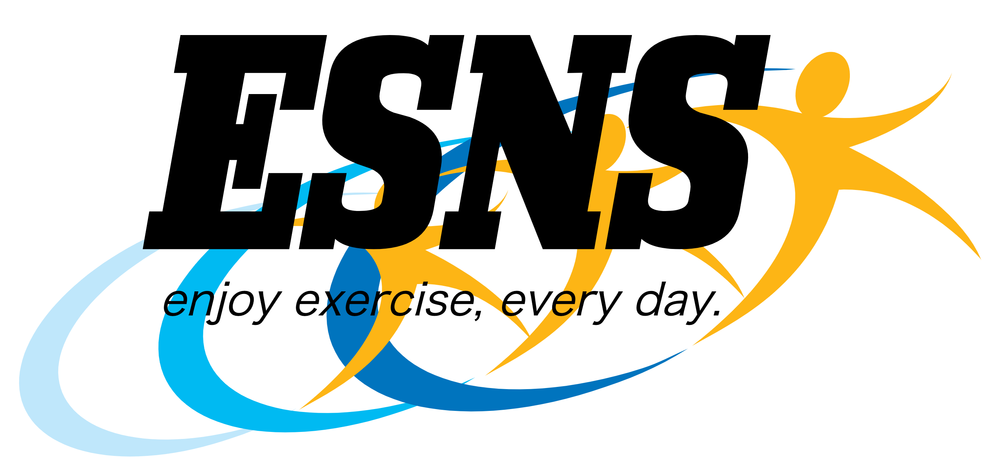

# ESNS(エスネス)

## サイト概要
ダイエットや運動の様子を投稿し、他のユーザーと共有を行うことができるアプリ**ESNS**です。
ダイエットなどに取り組まれているユーザーの投稿を見てやる気を出したり、
ユーザーが実践しているダイエット方法を、あなたは投稿から探す事ができます。
時にはユーザーにコメントなどでコンタクトを取り、価値の有るコミュニケーション関係を築きましょう。

**「全てのダイエットや運動を行う方を応援します。」**

### サイトテーマ
多くの人と共有しながら、楽しくダイエットや運動を行いたい方達へ贈るSNS

### テーマを選んだ理由
妻は日々ダイエットに励んでいます。
残念ながら、長期間継続して実施している姿を見たことがありません。
私が作成する初めての作品は、妻の役に立てるようなアプリをと考え、本テーマを選びました。
妻が楽しくダイエットを継続してくれる一助になることを願っています。
また、同じようにダイエットや運動を、継続して続けることが出来ない方々の役にも立てると考えています。

### ターゲットユーザ

 - ダイエットを楽しく継続的に行いたい人（主に女性）
 - 筋トレを楽しく継続的に行いたい人（主に男性）
 - 妻

### 主な利用シーン

 - 運動やダイエットに効果的な行動を行ったあと、それらの内容を投稿
 - すきま時間に、他の方が実践しているダイエットや筋トレ方法を探す
 - エクササイズに対してやる気がでないときに、他の人の投稿を見てモチベーションを向上させる

## 設計書

### 機能一覧
<https://docs.google.com/spreadsheets/d/1UgK-6l38k5T81XjcTIn7CHnGRkB_sBXS5xQWAVhWmks/edit#gid=0>

## 開発環境
- OS：Linux(CentOS)
- 言語：HTML,CSS,JavaScript,Ruby,SQL
- フレームワーク：Ruby on Rails
- JSライブラリ：jQuery
- 仮想環境：Cloud9

## 使用素材
- ### [Logo Factory](http://www.logofactoryweb.com/default_lg.asp?lg=ja) サイトロゴの作成に使用
-